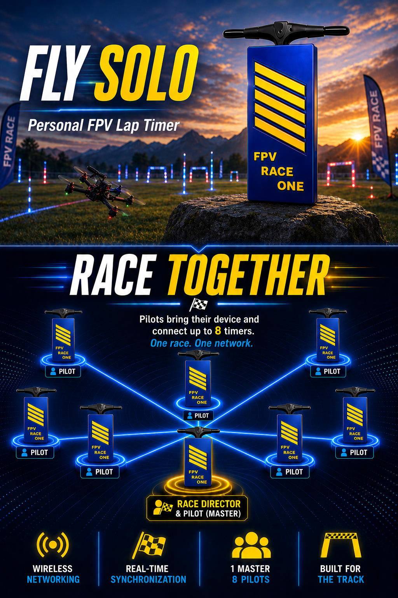

# FPVRaceOne

**Personal FPV Lap Timer**

A single node lap timer that can be networked for multi-pilot (multi-node) racing.

[](https://opensource.org/licenses/MIT)

A compact, self-contained RSSI-based lap timing solution for 5.8 GHz FPV drones. Perfect for personal practice sessions or small indoor tracks up to large scale race events. No transponders, no complex infrastructure — just plug in, calibrate, and fly.

**Up to 8 devices can mesh network and sync together for head-to-head racing** — one master device acts as race director and broadcasts Start / Stop to every connected client, with live laps streaming back from each pilot in real time. Acts like a mesh network. No router required. Even while meshed, each lap timer is still accessible by its own pilot.

---

## Screenshots

| Race Screen | Configuration |
|:-----------:|:-------------:|
|  |  |

| Calibration Wizard — Recording | Calibration Wizard — Complete |
|:------------------------------:|:-----------------------------:|
|  |  |

---

## How It Works

FPVRaceOne uses an RX5808 video receiver module to monitor your drone's RSSI (signal strength). As you fly through the gate:

1. **Approach** — RSSI rises above the Enter threshold → crossing begins
2. **Peak** — RSSI peaks when you're closest to the gate
3. **Exit** — RSSI falls below the Exit threshold → lap time recorded

```
RSSI  │     /\
      │    /  \
      │   /    \     ← Single clean peak
Enter ├──/──────\───
      │ /        \
Exit  ├/──────────\─
      └─────────────── Time
```

The time between consecutive peaks is your lap time. The signal processing pipeline is tuned with sensible defaults out of the box, with a single Pipeline Smoothing slider for fine-tuning the balance between responsiveness and noise rejection.

---

## Key Features

### Connectivity
- **WiFi Access Point** — works with any browser on any device with wifi, no app required
- **Mesh Network** — up to 7 lap timers can connect to a designated master unit, in addition to the standard Wifi Access Points.

### Signal Processing
A single 5-stage RSSI processing pipeline based on the upstream FPVGate algorithm:
**Kalman → Median-of-3 → 7-sample moving average → EMA → step limiter**

### RSSI Automatic Calibration Wizard
- Guided fly-over recording with real-time RSSI chart
- Automatic 3-peak detection with manual override
- Enter / Exit threshold calculation with conservative safety margins (Enter ≈ 95 % of weakest peak, Exit ≈ 7 RSSI units below Enter, raised above the noise floor)
- Peak-spread warning if the three peaks aren't reasonably equal — flagged for re-fly before applying
- Live RSSI chart shows exactly what the lap detector sees (final pipeline output)

### Multi-Node Racing — Built-In Race Directing
Network **up to 8 devices** together with no router and no extra hardware. One device runs in **Master** mode (race director); up to seven **Client** devices join the master's WiFi and forward laps automatically.

- **Master Recruit** — the master can force recruit (auto-connect) all nearby devices for a quick and painless networking setup.
- **One-tap Start All / Stop All** — broadcast a synchronised race start to every pilot on the network
- **Live per-pilot dashboard on the master** — each client renders as a card with pilot name, running indicator (●/○), live lap count, and last lap time, updated via Server-Sent Events with sub-second latency
- **DNF tracking** — a pilot who taps Stop locally during a master race shows up as **DNF** on the director's screen; the rest of the heat continues uninterrupted
- **Solo-practice override** — each client has an *Ignore Race Director Start/Stop if already racing* toggle so a director's broadcast doesn't kill an in-progress practice run
- **Master discovery** — clients can scan for available masters in range and pick one from a list (no manual SSID typing required)
- **Same UI on every device** — every client also runs as a fully featured standalone timer when no master is broadcasting
- Master has the ability to modify each node's frequency / channel, pilot name and color.

### Voice Announcements
- Spoken laps using your **browser's** built-in voice (Web Speech API) — no audio files on the device, so the announcer follows whichever device has the web UI open
- Configurable announcement format (pilot + lap + time, pilot + time, lap + time, time only)
- Per-pass beep or full speech, 2-lap and 3-lap consecutive variants

### Race Analysis
- Real-time lap tracking with gap-to-best analysis
- Fastest lap highlighting
- Fastest 3 consecutive laps (RaceGOW format)
- Interactive race timeline + playback for every saved session
- Marshalling mode — add, remove, or edit laps after the race ended
- Download the session as JSON; re-import later. **Race history lives in RAM only on the current hardware — download to keep**.

### Firmware Updates
- **One-tap OTA from GitHub Releases** — built into the device. Enter your home WiFi once; the device joins, checks the latest release, downloads the firmware + filesystem images, flashes both, and reboots.
- Updates are blocked while a race is running. Failed downloads keep the previous firmware, so the device can't be bricked from a flaky network.
- Manual flashing via PlatformIO / esptool is still available — see [docs/FLASHING_OPTIONAL.md](docs/FLASHING_OPTIONAL.md).

---

## Supported Bands & Frequencies

| Band | Channels (MHz) |
|------|----------------|
| **A (Boscam A)** | 5865, 5845, 5825, 5805, 5785, 5765, 5745, 5725 |
| **B (Boscam B)** | 5733, 5752, 5771, 5790, 5809, 5828, 5847, 5866 |
| **E (Boscam E)** | 5705, 5685, 5665, 5645, 5885, 5905, 5925, 5945 |
| **F (Fatshark)** | 5740, 5760, 5780, 5800, 5820, 5840, 5860, 5880 |
| **R (RaceBand)** | 5658, 5695, 5732, 5769, 5806, 5843, 5880, 5917 |
| **L (LowBand)** | 5362, 5399, 5436, 5473, 5510, 5547, 5584, 5621 |
| **DJI v1 25 MHz** | 5660, 5695, 5735, 5770, 5805, 5878, 5914, 5839 |
| **DJI v1 25 CE** | 5735, 5770, 5805, 5839 |
| **DJI v1 50** | 5695, 5770, 5878, 5839 |
| **DJI O3/O4 10/20** | 5669, 5705, 5768, 5804, 5839, 5876, 5912 |
| **DJI O3/O4 20 CE** | 5768, 5804, 5839 |
| **DJI O3/O4 40** | 5677, 5794, 5902 |
| **DJI O3/O4 40 CE** | 5794 |
| **DJI O4 RaceBand** | 5658, 5695, 5732, 5769, 5806, 5843, 5880, 5917 |
| **HDZero RaceBand** | 5658, 5695, 5732, 5769, 5806, 5843, 5880, 5917 |
| **HDZero E** | 5707 |
| **HDZero F** | 5740, 5760, 5800 |
| **HDZero CE** | 5732, 5769, 5806, 5843 |
| **Walksnail RaceBand** | 5658, 5659, 5732, 5769, 5806, 5843, 5880, 5917 |
| **Walksnail 25** | 5660, 5695, 5735, 5770, 5805, 5878, 5914, 5839 |
| **Walksnail 25 CE** | 5735, 5770, 5805, 5839 |
| **Walksnail 50** | 5695, 5770, 5878, 5839 |

---

## Quick Start

### Hardware

Pre-made and flashed hardware — (ETSY LINK Coming Soon!)

**[Detailed hardware setup →](docs/GETTING_STARTED.md)**

### Connect via WiFi

1. Power on the device
2. Connect your phone or laptop to the `FPVRaceOne_XXXX` network (password: `fpvraceone`)
3. Open `http://192.168.4.1` in your browser (`http://192.168.5.1` in Master mode)
4. Go to **Settings → Set your VTx band and channel**
5. Go to **Calibration → Run the wizard** to set RSSI thresholds
6. Press **Start** and fly!


**[Complete user guide →](docs/USER_GUIDE.md)**

---

## Firmware Updates

FPVRaceOne can check for and automatically updates itself from **GitHub Releases** — no PlatformIO, no cables, no flashing tools required for normal updates.

1. Open the web UI → **Settings → Firmware Update**
2. Enter your home WiFi credentials (one-time)
3. Tap **Check for Updates** — the device briefly joins your home network, queries GitHub, then returns to AP mode
4. If a newer release is available you'll see the version and release notes — tap **Update Now**
5. The device flashes the filesystem, then the firmware, then reboots once. Total time ~1–3 minutes.
6. Hard reload your browser to guarantee new changes are loaded (Ctrl+Shift+R on Windows/Linux, Cmd+Shift+R on Mac. Tap-and-hold the refresh button on mobile Chrome to get "Hard reload")

Updates are automatically blocked while a race is running. 

If a download fails the device keeps the previous firmware, so a flaky network can't brick it.


---

## Project Status

**Product:** FPVRaceOne  
**Platform:** Seeed XIAO ESP32-C6  
**License:** MIT  
**Status:** Stable Beta — actively maintained

### Changelog

**v1.1.0 (Current)**
- Renamed product to **FPVRaceOne**
- Added **V1 / V2 switchable signal processing** — runtime toggle between FPVGate multi-stage pipeline and RotorHazard Bessel IIR filter
- Added **Bessel filter cutoff selector** — 100 Hz / 50 Hz / 20 Hz for V2 mode
- Added **configurable detection parameters** — Enter Hold Samples and Exit Confirm Samples (V1), now persisted to config
- Added **V2 midpoint timestamping** — lap time recorded at the centre of the signal peak plateau
- Improved **ADC scaling** — corrected denominator for 6 dB attenuation range (avoids RSSI inflation)
- Fixed **Kalman filter Q/R inversion** — process noise and measurement noise were swapped; corrected for 29× improvement in filter responsiveness
- Fixed **RSSI display off-by-one** — `getRssi()` was returning 100-sample-old data
- Removed `vTaskDelay(50)` from debug logger — was stalling the RSSI loop by 50 ms on every threshold crossing event
- Increased **SSE update rate** from 5 Hz to 20 Hz for more responsive live RSSI display
- Moved webhook HTTP calls to Core 0 — prevents synchronous POST (up to 300 ms) from blocking the RSSI loop on Core 1
- Added **Save Configuration indicator** — button highlights orange with pulse animation when there are unsaved changes;
- Added `enterHoldSamples` and `exitConfirmSamples` to firmware config and settings UI (previously UI-only, not persisted)

---

## Credits

FPVRaceOne is derived from [FPVGate](https://github.com/LouisHitchcock/FPVGate) v1.2.0 by LouisHitchcock, which is itself a heavily modified fork of [PhobosLT](https://github.com/phobos-/PhobosLT) by phobos-. The original project provided the foundation for RSSI-based lap timing on ESP32.

Note that prior or alternate versions of FPVGate will not flash to FPVRaceOne official hardware.

---

## License

This project is licensed under the MIT License — see the [LICENSE](LICENSE) file for details.

---

*Built for pilots, by pilots.*
