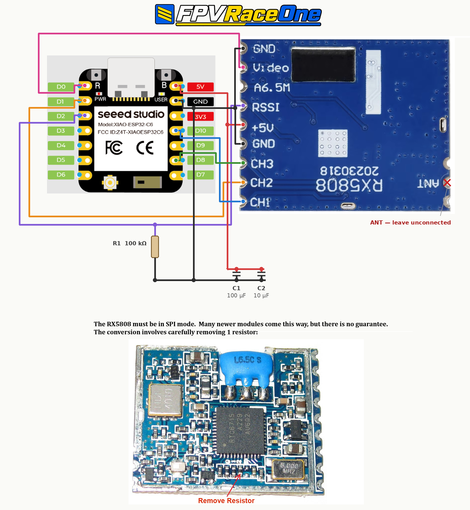

# Build an FPVRaceOne From Scratch

How to build your own FPVRaceOne lap timer from parts — wiring, assembly, and
flashing.

**Navigation:** [Home](../README.md) | [Getting Started](GETTING_STARTED.md) | [User Guide](USER_GUIDE.md) | [Flashing](FLASHING_OPTIONAL.md)

> Don't want to build one? A fully assembled, flashed and cased unit is
> available at the [FPVWidgets store](https://fpvwidgets.square.site).

---

## Table of Contents

1. [What You'll Need](#what-youll-need)
2. [Step 1 — Put the RX5808 in SPI Mode](#step-1--put-the-rx5808-in-spi-mode)
3. [Step 2 — Wiring](#step-2--wiring)
4. [Step 3 — The Support Components](#step-3--the-support-components)
5. [Step 4 — Check Before You Power It](#step-4--check-before-you-power-it)
6. [Step 5 — Flash the Firmware](#step-5--flash-the-firmware)
7. [Step 6 — First Power-On](#step-6--first-power-on)
8. [Step 7 — Verify the Build](#step-7--verify-the-build)
9. [Enclosure and PCB](#enclosure-and-pcb)
10. [Building the Firmware From Source](#building-the-firmware-from-source)
11. [Troubleshooting](#troubleshooting)

---

## What You'll Need

### Parts

| Qty | Part | Notes |
|----:|------|-------|
| 1 | **Seeed Studio XIAO ESP32-C6** | The only supported board. Not the C3, S3, or nRF variants — the pin map and the 160 MHz timing budget are specific to the C6 |
| 1 | **RX5808 5.8 GHz receiver module** | **Must be SPI-capable** — see [Step 1](#step-1--put-the-rx5808-in-spi-mode) |
| 1 | **R1 — 100 kΩ resistor** | ¼ W or smaller; pulls the RSSI line down |
| 1 | **C1 — 100 µF electrolytic capacitor** | 10 V or higher, across the RX5808 supply |
| 1 | **C2 — 10 µF capacitor** | Electrolytic or ceramic, across the RX5808 supply |
| 1 | **5.8 GHz antenna** | Fits the u.FL / IPEX connector on the edge of the RX5808 module |
| — | **Silicone wire, 28–30 AWG** | Seven short runs; fine stranded wire is much kinder to the RX5808 pads |
| 1 | **USB-C cable and a power source** | Any phone charger or USB power bank. See [Getting Started](GETTING_STARTED.md#what-you-need) for runtime estimates |

### Tools

- A fine-tip soldering iron (a chisel tip will bridge the RX5808 pads)
- Flux, solder, tweezers
- A multimeter — used for the continuity check in [Step 4](#step-4--check-before-you-power-it), which is the one step that stops a wiring
  mistake from becoming a dead module
- A hot-air station or a second iron, if your RX5808 needs the SPI conversion

### Skill level

Soldering to the RX5808's castellated edge pads is the hard part. The pads are
small and close together, and the module's ground plane pulls heat away. If
you've reflowed a 0603 part or repaired a flight controller, you'll be fine.

---

## Step 1 — Put the RX5808 in SPI Mode

**FPVRaceOne sets the receive frequency over SPI.** A module still in its
default hardware-channel mode will power up and produce an RSSI reading, but it
will sit on whatever channel its jumpers select and ignore every band/channel
change you make in the web UI — so laps get timed on the wrong frequency, or
not at all.

Many modules manufactured in the last few years ship SPI-ready, but there is no
way to tell from the listing and no guarantee from the seller. **The conversion
is the removal of a single resistor**, arrowed in the photo at the bottom of the
wiring diagram below.

1. Remove the metal shield can if one is fitted — it lifts off, or unclips at
   the tabs
2. Find the resistor arrowed in the diagram, along the bottom edge of the board
   near the crystal
3. Remove it with hot air, or by walking a fine iron tip back and forth across
   both ends with plenty of flux until it lets go
4. Check with a meter that the pad either side is now open

Take your time. There are parts either side of it, and a slip here ends the
module.

---

## Step 2 — Wiring



Seven connections. The wire colours below match the diagram.

| Wire | XIAO ESP32-C6 | RX5808 pad | What it carries |
|---|---|---|---|
| 🔵 Blue | **D10** | **CH1** | SPI data |
| 🟠 Orange | **D1** | **CH2** | SPI select (latch enable) |
| 🟢 Green | **D8** | **CH3** | SPI clock |
| 🟣 Purple | **D2** | **RSSI** | Analog signal strength — this is the one that times your laps |
| 🔴 Red | **5V** | **+5V** | Module power |
| ⚫ Black | **GND** | **GND** | Ground — the RX5808 has two GND pads; the diagram uses the one beside +5V |
| 🩷 Pink | **D0** | **Video** | Shown for completeness. **Optional** — the current firmware never reads D0, so a timer-only build can leave both ends off |

Three details that matter:

- **Power the module from 5V, not 3V3.** The RX5808 needs the full 5 V rail.
  The XIAO passes USB 5 V straight through to its `5V` pad, so a USB-C supply
  feeds the module directly.
- **RSSI must land on D2.** It's the analog input the sampler is wired to
  (`PIN_RX5808_RSSI A2`, and A2 is the D2 pad). Any other pin reads nothing.
- **Leave the RX5808's `ANT` pad unconnected** — it's marked with a red ✗ on the
  diagram. Your 5.8 GHz antenna goes on the u.FL connector at the module's
  edge, not on that pad.

You do **not** need an external WiFi antenna on the XIAO. The firmware runs the
C6's built-in ceramic antenna at full 21 dBm.

---

## Step 3 — The Support Components

These three parts are not optional. Without them the RSSI trace wanders and the
calibration wizard produces thresholds that don't hold.

**R1 — 100 kΩ, from the RSSI wire to ground.** Connect it anywhere along the
purple line: one leg on the D2 / RSSI net, the other on the ground rail. It
holds the input at a known level instead of letting it float, which is what
keeps your noise floor flat when no VTX is transmitting.

**C1 (100 µF) and C2 (10 µF) — both across the RX5808 supply**, positive leg on
the red 5 V rail, negative leg on the black ground rail. Put them as close to
the module's `+5V` and `GND` pads as the build allows. The receiver's current
draw is lumpy; these keep that off the rail the ADC is measuring against.
Observe polarity on the electrolytics.

---

## Step 4 — Check Before You Power It

Do this with the multimeter, before anything is plugged in. It takes two
minutes and it's the difference between a working timer and a dead RX5808.

1. **5V to GND** — no continuity. A short here kills the module the instant you
   plug in USB
2. **Each signal pin to its pad** — continuity on all four: D10↔CH1, D1↔CH2,
   D8↔CH3, D2↔RSSI
3. **Each signal pin to its neighbours** — no continuity. Bridged CH pads are
   the most common failure on this build
4. **Electrolytic polarity** — negative stripe to ground on both C1 and C2
5. **D2 to GND** — should read about 100 kΩ, which confirms R1 is actually in
   circuit

---

## Step 5 — Flash the Firmware

Brand-new hardware has no bootloader, no partition table and no filesystem, so
it needs a **Recovery**-mode flash — the full image written from offset 0x0. The
FPVRaceOne Flasher does this in one click; everything after this first flash can
be done over the air from the web UI.

### Get the flasher

Download **[FPVRaceOne-Flasher.exe](https://github.com/ramiss/FPVRaceOne-Flasher/releases/latest/download/FPVRaceOne-Flasher.exe)**
(Windows, portable — no installer). The link always resolves to the current
build, which then lets you pick any published firmware release.

### Flash it

1. **Plug the XIAO into your computer with a USB-C data cable.** Charge-only
   cables are the number one cause of "no devices found" — if nothing appears in
   Step 4 below, try a different cable first
2. **Run `FPVRaceOne-Flasher.exe`.** Windows SmartScreen may warn about an
   unrecognised publisher; choose *More info → Run anyway*
3. Under **Firmware source**, leave **Download from GitHub** selected
4. Under **Devices (ESP32)**, confirm your board is listed and ticked — it shows
   as something like `COM7 — USB Serial Device`. Click **Refresh** if it isn't
   there
5. Under **Version**, pick the release you want. The newest is at the top. Tick
   **Include pre-releases (beta)** only if you're deliberately testing one
6. Under **Flash mode**, select **Recovery — full reflash for a bricked device
   (merged + filesystem)**. This is the correct mode for new hardware: it writes
   the bootloader, partition table and filesystem, which Update mode leaves
   alone
7. Click **Flash**. The log pane shows the download, then the erase and write.
   It takes about a minute
8. Wait for the success line, then unplug and replug the device

> **If the flasher can't connect**, put the C6 into bootloader mode by hand:
> hold the **B** (boot) button, tap **R** (reset), then release **B**. The two
> buttons flank the USB connector — they're labelled on the diagram above.
> Click **Refresh**, then **Flash** again.

> **Recovery mode erases saved settings** — band, channel, calibration, pilot
> name, WiFi credentials. That's exactly what you want on a fresh board. For
> later reflashes of a configured unit, use **Update** mode, which preserves
> them. See [FLASHING_OPTIONAL.md](FLASHING_OPTIONAL.md) for the full
> comparison.

---

## Step 6 — First Power-On

1. Power the device from USB-C and wait 10–15 seconds
2. On your phone or laptop, look for the WiFi network **`FPVRaceOne_XXXX`**
   (XXXX = the last 4 digits of the device's MAC address)
3. Password: **`fpvraceone`**
4. Open **`http://192.168.4.1`** in a browser

If the access point appears and the page loads, the XIAO half of the build is
good.

---

## Step 7 — Verify the Build

The firmware can tell you whether the receiver is actually wired correctly —
you don't have to guess.

1. Attach the 5.8 GHz antenna to the RX5808's u.FL connector
2. In the web UI, go to **Settings → Diagnostics**
3. Click **Run System Self-Test**

Read the **RSSI Noise Floor** result. It samples the receiver for one second on
your currently configured frequency and reports the floor, mean and peak:

- **A plausible floor and mean, comfortably below your Exit threshold** — the
  RX5808 is powered, in SPI mode, tuned where you asked, and its RSSI output is
  reaching D2. The build is good.
- **A flat reading of 0, or a value pinned at the top of the range** — the RSSI
  wire, R1, or the module's power is wrong. Go back to
  [Step 4](#step-4--check-before-you-power-it).
- **A noise floor sitting at or above your Exit threshold** — either the bench
  is genuinely noisy (a powered VTX in the room will do it), or the module never
  took the SPI frequency and is parked on a busy channel. Power down any nearby
  VTX and re-run before suspecting the wiring.

Then set your band and channel in **Settings**, and run the **Calibration
Wizard** — [Getting Started](GETTING_STARTED.md#run-the-calibration-wizard) walks
through it.

---

## Enclosure and PCB

Two things in this repository save you from a rat's nest of wire:

- **[`case/`](../case/)** — printable enclosures as `.3mf`. `FPVRaceOne_Case_20260730.3mf`
  is the current single-unit case; the `_x4` file is a four-up plate, and
  `_ironed` is tuned for ironed top surfaces.
- **[`PCB/`](../PCB/)** — the KiCad project for the FPVRaceOne board, which
  carries the XIAO, the RX5808, and R1/C1/C2 with no hand wiring at all. Render
  images are in [`Schematic/`](../Schematic/).

A hand-wired build on the diagram above is electrically identical to the PCB.
The PCB is tidier, more repeatable, and fits the printed case.

---

## Building the Firmware From Source

Optional — the released binaries in Step 5 are the same thing. You'd do this to
modify the firmware.

You'll need [PlatformIO](https://platformio.org/) (the VS Code extension, or
the standalone CLI).

```bash
git clone https://github.com/ramiss/FPVRaceOne.git
cd FPVRaceOne

# Firmware
pio run -e seeed_xiao_esp32c6 -t upload

# Web UI filesystem — required, and separate from the firmware
pio run -e seeed_xiao_esp32c6 -t uploadfs
```

Both steps are needed: `upload` writes the application, `uploadfs` writes the
LittleFS image holding the web UI. Flash the firmware without the filesystem
and the device boots but serves nothing.

There is also a **`seeed_xiao_esp32c6_release`** environment. It's the same
build with the bench instrumentation compiled out (`HARNESS_LOG_ENABLED=0`,
`TIMING_MARKER_ENABLED=0`) and is what published releases are built from. Use
it for anything you intend to fly:

```bash
pio run -e seeed_xiao_esp32c6_release -t upload
pio run -e seeed_xiao_esp32c6_release -t uploadfs
```

---

## Troubleshooting

| Symptom | Likely cause |
|---|---|
| No `FPVRaceOne_XXXX` WiFi network after 20 s | Firmware didn't flash, or the filesystem image is missing. Reflash in Recovery mode |
| WiFi appears but `192.168.4.1` doesn't load | Filesystem not written. Recovery mode writes both — Update mode after a failed firmware-only flash will not |
| Flasher shows "no ESP32 devices found" | Charge-only USB cable, or the board needs manual bootloader mode (hold **B**, tap **R**, release **B**) |
| Flasher reports "please update the tool" | The release uses a newer manifest than your flasher build. Download the current `FPVRaceOne-Flasher.exe` |
| Self-test RSSI reads a flat 0 | RSSI wire not on **D2**, R1 missing, or the RX5808 has no 5 V |
| RSSI reads high and never moves | RSSI line shorted to 5 V, or R1 wired to the wrong net |
| Band/channel changes have no effect on RSSI | The RX5808 is not in SPI mode — revisit [Step 1](#step-1--put-the-rx5808-in-spi-mode) |
| Noise floor close to the Exit threshold | A powered VTX nearby, or the module is parked on a busy channel because SPI never took |
| Laps detected erratically or not at all | Re-run the Calibration Wizard. If it still misbehaves, check C1/C2 are present and close to the module |

---

**[← Back to README](../README.md)**
